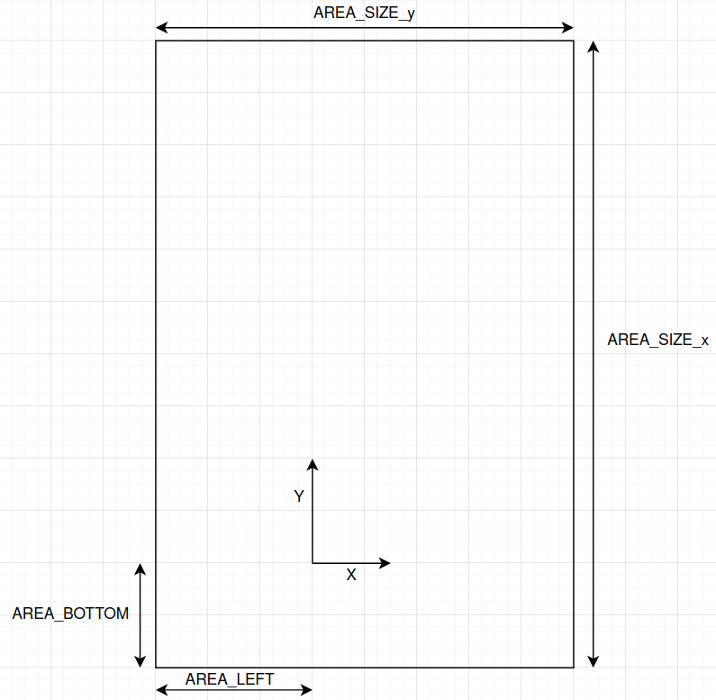

# gmm_coverage #

This repository contains C++ and Python code to define and handle Gaussian Mixture Models for robots formation control.

### What is this repository for? ###

* Definition of Gaussian Mixture Models from a polygon drawn on a graphical interface.
* Control software to drive robots towards the region of interest. 

### Requirements ###

* Install SFML libray (for further information: https://www.sfml-dev.org/tutorials/2.5/start-linux.php):
`sudo apt-get install libsfml-dev`

* Install ROS2-foxy (UBUNTU 20.04) and configure the environment, following the tutorial at: https://docs.ros.org/en/foxy/Tutorials.html .
* If you are using ROS1 environment, you should install ROS1-ROS2 bridge in order to allow the communication between the two environments. Follow the tutorial for the installation at: https://github.com/ros2/ros1_bridge . N.B! The messages types and topic name should be equal to allow the communication.

### How to use ###

* Download the package and compile it.
* Launch the node with:
`ros2 run coverage_unimore_nyu coverage_uav` this will use the parameters inside the node
or 
`ros2 launch coverage_unimore_nyu launch_coverage.launch.py` this will use the parameters set in the launch file

### Area size, Area left, Area bottom parameters ###

* Set the parameters AREA_SIZE_x, AREA_SIZE_y, AREA_BOTTOM, AREA_LEFT depending on the environment dimension in which the robot can move and depending on the global reference system.
* Higher is the robot range, higher is the coverage performance on the defined environment.

